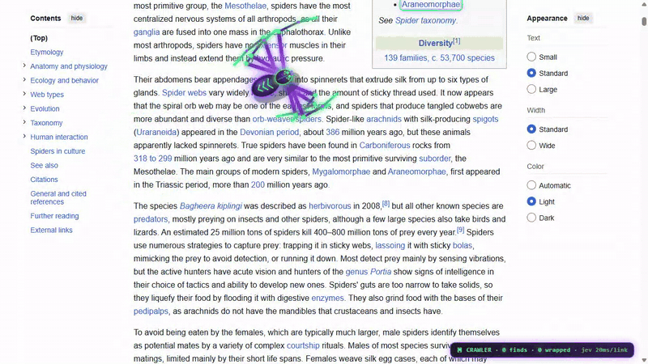
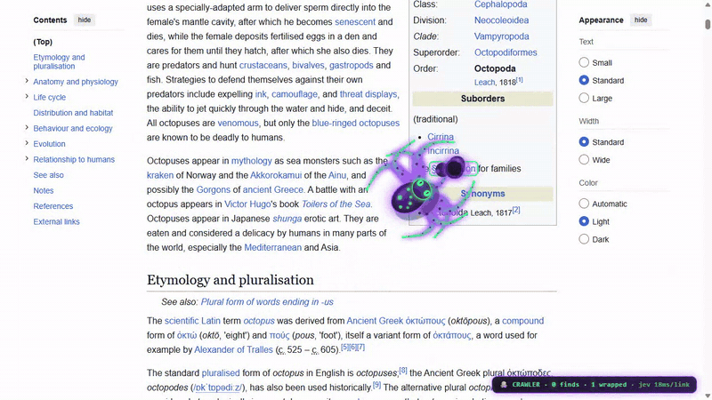
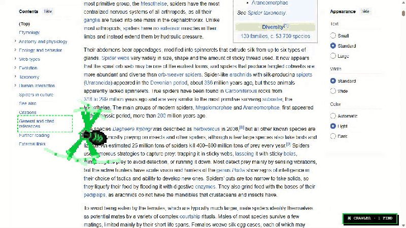

# 🕷 Spider Crawler

A Chrome / Edge / Brave extension that drops **one big creature** onto any web page. Pick a **spider**, an **octopus** or a **slime**.

It crawls the page, **grabs the links you are hunting for** and **wraps everything else** in silk, ink or goo.

Turn on **Jev** (a decision model) and it judges every link by meaning, not keywords. On real Wikipedia pages that took about **17 to 20 ms per link**.

**▶ [Watch the 38 s showcase clip (mp4)](https://github.com/AlungranPJ/spider-crawler-extension/raw/main/docs/showcase.mp4)**: spider + Jev, octopus, slime, 8-bit.

| 🕷 Spider + Jev hunt | 🐙 Octopus + Jev hunt |
|---|---|
|  |  |
| **🧪 Slime** | **👾 8-bit mode** |
|  |  |

Separate clips: [spider](docs/demo-jev.mp4), [octopus](docs/demo-octopus.mp4), [slime](docs/demo-slime.mp4).

## Creatures

| | Moves like | Grabs a match | Wraps a non-match |
|---|---|---|---|
| 🕷 **Spider** | 8 legs with 2-bone IK and an alternating tetrapod gait. Feet stay planted on the page | Bites it, then silk line and pulse rings | Silk cocoon spiral |
| 🐙 **Octopus** | 8 wavy tentacles with suckers. Tips stick to the page and step with the same IK gait | Shoots a tentacle out to the link | Ink cloud |
| 🧪 **Slime** | A bouncy blob that squashes and stretches on every hop and leaves a goo trail | Stretches a pseudopod and absorbs it | Goo blob that drips |

You can switch creatures live from the toolbar popup.

## Features

- **Hunt mode.** Type what you want (`spiders`, `pricing pages`, `open-source AI tools`...).
  - Matches are grabbed and ripped into the HUD.
  - Non-matches are wrapped.
  - Leave it empty and every link is a find.
- **Jev judging (optional).** Every visible link on the page is judged in **one batched yes/no call**. Without a key it falls back to keyword matching.
- **Skins.** 6 built-ins: Venom (purple x green), Laya (ice blue), Ember, Ghost, Black Gold and Matrix. A color editor lets you make your own, and skins export and import as JSON so you can share them. Skins work on all three creatures.
- **Neon or 8-bit.** Neon has glow and gradients. 8-bit renders at 1/4 resolution with hard pixels and a retro HUD.
- **Size and speed sliders**, plus a HUD toggle.
- **Crawl log.** Every find is saved locally. Export it as JSON from the popup.

## Install (2 minutes)

1. Download the latest `spider-crawler-vX.Y.Z.zip` from [Releases](../../releases) and unzip it. You can also clone this repo.
2. Open `chrome://extensions` (or `edge://extensions`, `brave://extensions`).
3. Turn on **Developer mode**.
4. Click **Load unpacked** and pick the unzipped folder (the one containing `manifest.json`).
5. Open any website. The creature starts crawling.

Click the toolbar icon for quick settings: on/off, hunt, creature, mode, skin and the crawl log. **Skins, colors & Jev settings** opens the full options page. The creature crawls the options page too, so you can preview changes live.

## Using Jev

Jev is TypeSafe's decision model. It only answers typed questions (yes/no, choice, score), so it is fast and cheap for "is this link what I'm hunting for?"

1. Get a key from one of these providers:

   | Provider | Notes |
   |---|---|
   | TypeSafe | `api.typesafe.ai` |
   | OpenCode Zen | Has a **free tier** (`jev-1.13-free`) |
   | OpenRouter | Uses its Decisions API |
   | Venice | Serves Jev through its decisions API |

2. Open the options page, pick the provider, paste the key and press **Save key**.
3. Press **Test Jev**. You should see something like `"Jumping spider" yes=0.87, "Privacy policy" yes=0.01`.
4. Type something in **Hunt for**.

Each request sends the page title and URL plus the visible links (text and URL, up to 16 per call), with one `noul` (probability of yes) question per link. A link is grabbed when `p(yes) >= threshold`, which defaults to 0.5.

**Privacy:** your key is stored only in `chrome.storage.local` in your browser. It is never synced and never exposed to web pages, and it is sent only to the provider you picked, from the extension's background service worker. Nothing else is uploaded anywhere.

## Skin JSON

```json
{
  "name": "Pink Venom",
  "shell": "#10051c", "shellMid": "#2a0b4a", "shellHi": "#5a1a9a",
  "leg": "#b04dff", "legTip": "#39ff88", "accent": "#ff00aa",
  "glow": "#b04dff", "eye": "#39ff88"
}
```

Paste this into **Skin JSON** on the options page and press **Import JSON as skin**. PRs with new built-in skins are welcome (`shared.js`).

## How it works

| File | Role |
|---|---|
| `content.js` | Canvas overlay, creatures (IK legs, tentacles, soft-body slime), hunting, grab / wrap effects, HUD |
| `background.js` | Calls the Jev provider (MV3 service worker, so no page CORS) |
| `shared.js` | Skins and default settings |
| `popup.*`, `options.*` | Settings UI |

There are no dependencies and no build step. It is plain Manifest V3.

## Credits

Inspired by the "four decision models racing down a web page" spider video from [atomic.chat](https://x.com/atomic_chat_hq/status/2107828492297720017). This is an independent project, not affiliated with atomic.chat, TypeSafe, OpenAI or Anthropic.

Built with Claude (via the Hermes agent). The code was written, run and tested in a real Chromium with Playwright.

## License

MIT
